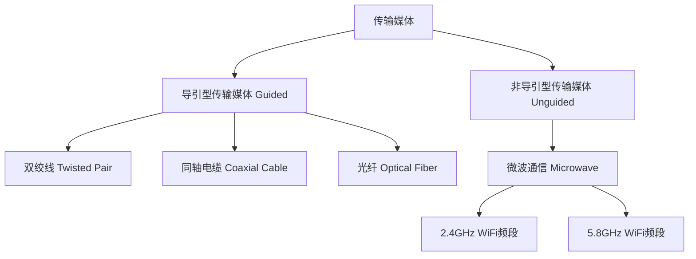

<iframe src="https://player.bilibili.com/player.html?aid=514946641&bvid=BV18g411D7Fm&cid=817181637&page=11&autoplay=0" scrolling="no" border="0" frameborder="no" framespacing="0" allow="fullscreen; picture-in-picture" allowfullscreen="true" style="height:100%;width:100%; aspect-ratio: 16 / 9;"> </iframe>

## 1. 📍 物理层的核心作用
> [!abstract] 物理层核心定义
> **物理层**是计算机网络体系结构中的最底层，主要负责在各种传输媒体上传输**比特0和1**，为数据链路层提供**透明传输比特流**的服务。

### 1.1. 🔍 关键理解
- **解决问题**：在各种传输媒体上传输比特0和1
- **服务对象**：为数据链路层提供服务
- **透明性**：数据链路层看不见也无需看见物理层具体的传输方法

## 2. 📊 传输媒体分类

计算机网络中连接各种网络设备的传输媒体可以分为两大类：

### 2.1. 🎯 导引型传输媒体 (Guided Transmission Media)

| 媒体类型     | 特性                | 应用场景         |
| -------- | ----------------- | ------------ |
| **双绞线**  | 两根绝缘铜线绞合而成，减少电磁干扰 | 以太网、电话线      |
| **同轴电缆** | 中心导体+绝缘层+网状导体+外皮  | 有线电视、早期局域网   |
| **光纤**   | 利用光脉冲在玻璃纤维中传输     | 高速主干网络、长距离传输 |

### 2.2. 📡 非导引型传输媒体 (Unguided Transmission Media)

| 媒体类型            | 特性             | 应用场景       |
| --------------- | -------------- | ---------- |
| **微波通信**        | 使用微波频段进行无线传输   | WiFi无线网络   |
| **2.4GHz WiFi** | 常用频段，穿透力较强但干扰多 | 家庭/办公室无线网络 |
| **5.8GHz WiFi** | 高频段，速度快但穿透力较弱  | 高速无线网络     |

---

## 3. 🏗️ 物理层的四大特性

物理层协议主要包含**四个方面的特性**，这些特性定义了物理接口的完整规范：

> [!note] 物理层协议关键点
> 由于传输媒体种类众多（双绞线、光纤等）且物理连接方式多样（点对点、广播等），因此**物理层协议种类繁多**。每种协议都包含了这四大特性，但具体内容各异。

### 3.1. 📋 四大特性详细说明

| 特性 | 定义 | 具体内容 | 示例 |
|------|------|----------|------|
| **1. 机械特性** (Mechanical Characteristics) | 接口的物理结构规范 | - 接线器的形状和尺寸 - 引脚数目和排列顺序 - 固定和锁定装置 | RJ-45水晶头尺寸、USB接口形状 |
| **2. 电气特性** (Electrical Characteristics) | 信号电压规范 | - 接口电缆各条线上的电压范围 - 信号电平的标准值 | TTL电平(0-5V)、RS-232电平(±3-15V) |
| **3. 功能特性** (Functional Characteristics) | 信号功能定义 | - 某条线上特定电压电平的意义 - 每条线路的功能定义 | 数据线、控制线、时钟线、接地线 |
| **4. 过程特性** (Procedural Characteristics) | 通信过程规范 | - 不同功能事件的先后顺序 - 通信建立、保持和释放的过程 | 握手协议、时序关系、状态转换 |

---

## 4. 🎓 学习重点与目标

> [!tip] 学习建议
> 在学习物理层时，**应将重点放在掌握基本概念上，而不是某个具体的物理层协议**。因为协议种类繁多，掌握核心原理更为重要。

### 4.1. 📌 核心概念理解
1. **物理层的定位**：
   - 物理层位于OSI/RM模型的最底层
   - 直接与传输媒体打交道
   - **向上提供服务**：为数据链路层提供比特流传输服务

2. **透明性服务**：
   > [!important] "透明"的含义
   > 所谓的"透明"是指**数据链路层看不见，也无需看见物理层究竟使用的是什么方法来传输比特0和1的**。它只管享受物理层提供的比特流传输服务即可。

3. **屏蔽差异**：
   - 物理层为数据链路层**屏蔽了各种传输媒体的差异**
   - 数据链路层只需考虑如何完成本层的协议和服务
   - **不必关心**网络具体使用的传输媒体是什么

### 4.2. ✅ 学习目标总结
通过本节课的学习，你应该能够：

- ✅ **理解并记住**：物理层考虑的是**怎样在连接各种计算机的传输媒体上传输数据比特流**
- ✅ **明确认知**：物理层的主要任务是**为数据链路层提供透明传输比特流的服务**
- ✅ **掌握要点**：物理层协议包含**机械、电气、功能、过程**四大特性
- ✅ **建立观念**：学习重点应是**掌握基本概念**而非具体协议细节

---

## 5. 🗂️ 知识关联

### 5.1. 🔗 与OSI模型的关系
- **位置**：OSI/RM七层模型的第一层
- **上层**：直接服务于数据链路层（第二层）
- **下层**：直接与物理传输媒体交互

### 5.2. 🔗 与TCP/IP模型的关系
- 对应TCP/IP模型的**网络接口层**的一部分
- 在实际网络中，物理层与数据链路层常常紧密耦合

---

## 6. 💡 思考与延伸
1. **为什么物理层协议种类繁多？**
   - 传输媒体多样性（有线/无线）
   - 连接方式多样性（点对点/广播）
   - 应用场景差异（短距离/长距离、高速/低速）

2. **透明性设计的好处？**
   - 上层协议不受底层物理变化影响
   - 提高了网络系统的可扩展性和兼容性
   - 实现了**分层设计的核心优势**

3. **四大特性的实际意义？**
   - 确保了不同厂商设备的**物理兼容性**
   - 定义了**可靠通信的物理基础**
   - 为上层协议提供了**稳定的传输环境**

